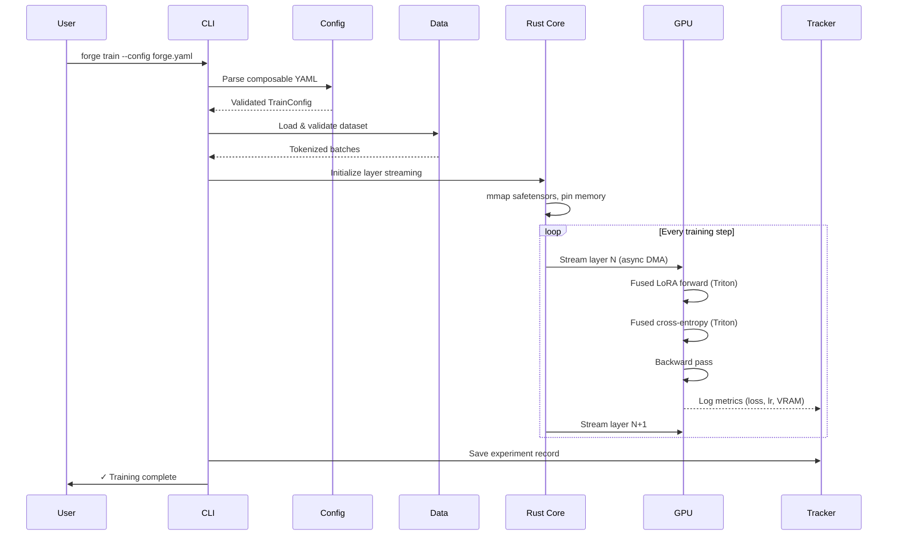

<p align="center">
  
</p>

<h1 align="center">Forge</h1>

<p align="center">
  <strong>Shape raw models into production weapons. Rust-accelerated LLM fine-tuning with built-in provenance.</strong>
</p>

<p align="center">
  <a href="#quick-start">Quick Start</a> ·
  <a href="#architecture">Architecture</a> ·
  <a href="#features">Features</a> ·
  <a href="#layer-streaming">Layer Streaming</a> ·
  <a href="docs/">Docs</a> ·
  <a href="#contributing">Contributing</a>
</p>

<p align="center">
  
  
  
  
  
  <a href="https://github.com/Paramveersingh-S/Forge/actions"></a>
  
</p>

---

Forge is a **Rust-accelerated**, CLI-first LLM post-training platform. One YAML config, one command, done — but with a Rust I/O core that eliminates GIL bottlenecks, custom Triton kernels that fuse LoRA operations, and a training-provenance stack that makes every adapter auditable from first gradient to production deploy.

```bash
pip install "forge-llm[train]"
forge init --preset llama3-8b-chat
forge train
```

Fine-tune **Llama-3.1-8B on a 4 GB laptop GPU**. The Rust-powered layer streaming engine keeps the frozen base in system RAM and feeds it to the GPU one decoder layer at a time through async DMA — peak VRAM is bounded by a single layer, not the whole model.

```yaml
# forge.yaml — composable config
extends:
  - recipes/llama3-8b.yaml
  - presets/qlora-4bit.yaml

training:
  stream_layers: true    # base streams out of VRAM
  method: sft
  batch_size: 4
  learning_rate: 2e-4
```

---

## Why Forge?

Training LLMs is still painful. Even experienced teams spend 30–50% of their time fighting infrastructure instead of improving models. Existing tools make you choose between **speed** (Unsloth), **flexibility** (Axolotl), or **simplicity** (LLaMA-Factory). Forge refuses the trade-off.

| Dimension | Soup CLI | Unsloth | Axolotl | **Forge** |
|:---|:---|:---|:---|:---|
| **I/O Core** | Python | Python | Python | **Rust (PyO3)** |
| **GPU Kernels** | Upstream HF | Custom Triton | Standard | **Custom Triton** |
| **Config** | Monolithic 6800-line schema | Python API | YAML | **Composable YAML fragments** |
| **Memory** | Layer streaming (Python) | Triton-optimized | Standard | **Rust layer streaming + Triton** |
| **Provenance** | CLI-only BOM | ✗ | ✗ | **Full stack + team audit** |
| **Experiments** | External only | ✗ | ✗ | **Built-in SQLite tracker** |
| **Team Mode** | Single user | Single user | Single user | **Team workspaces + RBAC** |
| **CI/CD** | Basic | ✗ | ✗ | **First-class GitHub Actions** |

---

## Architecture

```mermaid
graph TB
    subgraph "CLI Layer · Python + Typer"
        CLI["forge CLI<br/>init · train · eval · ship · deploy"]
    end

    subgraph "Config Engine"
        CF["Composable YAML<br/>extends · presets · overrides"]
        SCH["Split Pydantic Schemas<br/>LoRA · Training · Data · Eval"]
    end

    subgraph "Rust Core · forge-core (PyO3)"
        RS_STREAM["Layer Streaming I/O<br/>mmap · async DMA · pinned buffers"]
        RS_SAFE["Safetensors Parser<br/>zero-copy deserialization"]
        RS_SIGN["Crypto Engine<br/>ed25519 signing · SHA-256"]
    end

    subgraph "Training Engine · Python"
        TRAIN["Trainer Registry<br/>decorator-based dispatch"]
        SFT["SFT"] --> TRAIN
        DPO["DPO"] --> TRAIN
        GRPO["GRPO"] --> TRAIN
        KTO["KTO"] --> TRAIN
        ORPO["ORPO"] --> TRAIN
    end

    subgraph "Triton Kernels"
        K_LORA["Fused LoRA MatMul<br/>x@W + x@A@B in one pass"]
        K_CE["Fused Cross-Entropy<br/>no full logits materialization"]
        K_QUANT["Quantized MatMul<br/>NF4 dequant + GEMM fused"]
    end

    subgraph "Data Pipeline"
        DP["Smart Loader<br/>auto-format · validation"]
        DQ["Quality Scoring<br/>perplexity · diversity · toxicity"]
        DD["Semantic Dedup<br/>embedding-based near-duplicate"]
    end

    subgraph "Experiment Tracking"
        DB["SQLite Experiment DB<br/>zero-config · portable"]
        CMP["Run Comparator<br/>metric overlays · diffs"]
        EXP["Export<br/>→ MLflow · WandB · SwanLab"]
    end

    subgraph "Eval & Governance"
        EV["Eval Engine<br/>MMLU · HumanEval · custom DSL"]
        SG["Ship Gate<br/>SHIP / DON'T SHIP + noise floor"]
        BOM["ML-BOM<br/>CycloneDX · SPDX · in-toto"]
        SIGN["Adapter Signing<br/>ed25519 · Merkle root"]
        COMP["Compliance<br/>EU AI Act · HIPAA · SOC 2"]
    end

    subgraph "Deploy"
        EXPORT["Export<br/>GGUF · SafeTensors · ONNX · CoreML"]
        PUSH["Push<br/>Ollama · HuggingFace · vLLM"]
    end

    CLI --> CF
    CF --> SCH
    CLI --> TRAIN
    TRAIN --> RS_STREAM
    TRAIN --> K_LORA
    TRAIN --> K_CE
    TRAIN --> DP
    TRAIN --> DB
    RS_STREAM --> RS_SAFE
    SG --> SIGN
    SIGN --> RS_SIGN
    SG --> PUSH
```



### Data Flow



---

## Features

### 🔥 Rust-Accelerated Layer Streaming

The frozen base model lives in system RAM. A Rust core (`forge-core`) streams one decoder layer at a time into a pool of pre-allocated VRAM buffers through async CUDA DMA — the GIL never touches the hot path.

```
┌─────────────────────────────────────────────────────┐
│                   System RAM                         │
│  ┌─────────┬─────────┬─────────┬─────────┬───────┐  │
│  │ Layer 0 │ Layer 1 │ Layer 2 │   ...   │ Ln-1  │  │
│  └────┬────┴─────────┴─────────┴─────────┴───────┘  │
│       │  Rust async DMA (one layer at a time)        │
└───────┼─────────────────────────────────────────────┘
        ▼
┌─────────────────────────────────────────────────────┐
│                   GPU VRAM (4 GB)                    │
│  ┌──────────────┐  ┌──────────────┐  ┌───────────┐  │
│  │ Buffer A     │  │ Buffer B     │  │ LoRA      │  │
│  │ (1 layer)    │  │ (prefetch)   │  │ Adapters  │  │
│  └──────────────┘  └──────────────┘  │ + Grads   │  │
│                                      │ + Optim   │  │
│         Peak VRAM = 1 layer          └───────────┘  │
└─────────────────────────────────────────────────────┘
```

- **Double-buffered prefetch**: While the GPU computes on buffer A, Rust prefetches the next layer into buffer B
- **RAM tier**: Page-locked (pinned) host memory for 6–7× throughput vs pageable
- **NVMe disk tier**: When RAM is insufficient, stream from NVMe with direct I/O
- **NF4 quantization**: Shrink the base ~4×, so 8B fits in ~3.3 GB

### ⚡ Custom Triton Kernels

Three fused kernels eliminate redundant memory round-trips:

| Kernel | What It Fuses | VRAM Savings |
|:---|:---|:---|
| `lora_fused_forward` | `(x @ W) + (x @ A @ B) * scale` — 3 matmuls → 1 | ~30% fewer intermediates |
| `fused_cross_entropy` | Softmax + log + NLL without materializing logits | Saves `batch × seq × vocab` tensor |
| `quantized_matmul` | NF4 dequantize + GEMM in one pass | No dequantized copy |

### 🧩 Composable Configuration

No more editing a 6,800-line monolith. Forge configs are **fragments that compose**:

```yaml
# forge.yaml
extends:
  - recipes/llama3-8b.yaml          # Model recipe (weights, tokenizer, arch)
  - presets/qlora-4bit.yaml          # Quantization preset
  - presets/sft-chat.yaml            # Training method defaults

overrides:
  training:
    batch_size: 8
    learning_rate: 3e-4
    max_steps: 1000
  data:
    path: ./my_dataset.jsonl
```

```yaml
# recipes/llama3-8b.yaml
model:
  name: meta-llama/Llama-3.1-8B-Instruct
  type: llama
  context_length: 8192

lora:
  r: 64
  alpha: 16
  target_modules: [q_proj, k_proj, v_proj, o_proj, gate_proj, up_proj, down_proj]
```

### 📊 Built-in Experiment Tracking

Zero-config SQLite database tracks every run automatically. No WandB account, no MLflow server, no setup.

```bash
forge experiment list                    # List all experiments
forge experiment compare run_01 run_02   # Side-by-side metrics
forge experiment export run_01 --to mlflow  # Export to external tracker
```

| Feature | Detail |
|:---|:---|
| Metric logging | Loss, LR, gradient norms, VRAM, throughput — automatic |
| Run comparison | Metric overlays with statistical significance tests |
| Artifact tracking | Config snapshots, adapter checksums, dataset fingerprints |
| Export | MLflow, WandB, SwanLab, CSV |

### 🛡️ Training Provenance

Every adapter Forge produces is auditable from first gradient to production deploy:

| Standard | Implementation |
|:---|:---|
| **CycloneDX ML-BOM** | Machine-readable bill of materials for the adapter |
| **SLSA-3 in-toto** | Cryptographic attestation of the training pipeline |
| **EU AI Act Annex XI/XII** | Auto-generated compliance documentation |
| **HIPAA / SOC 2** | Audit logs with retention and rotation policies |
| **ed25519 Signing** | Detached signatures for adapter weights |
| **Backdoor Scanning** | Spectral analysis for rank-1 dominant tensors |

```bash
forge bom emit --format cyclonedx     # Generate ML-BOM
forge attest sign --key private.pem    # Sign the training attestation
forge adapters scan ./my-lora          # Scan for backdoor signatures
```

### 🚀 Training Methods

| Method | Type | Description |
|:---|:---|:---|
| **SFT** | Supervised | Instruction-following fine-tuning |
| **DPO** | Preference | Direct preference optimization |
| **GRPO** | RL | Group relative policy optimization (DeepSeek-style) |
| **KTO** | Preference | Kahneman-Tversky optimization (unpaired data) |
| **ORPO** | Preference | Odds ratio preference optimization (no ref model) |
| **SimPO** | Preference | Simple preference optimization |
| **PPO** | RL | Proximal policy optimization with reward model |
| **Distillation** | Transfer | Knowledge distillation from teacher to student |
| **Reward Model** | RL | Train a reward model for RLHF |
| **Unlearn** | Safety | Targeted knowledge removal (GDPR compliance) |

### 🔒 Ship Gate

One command decides if your fine-tune is safe to deploy:

```bash
forge ship --base ./base --adapter ./my-lora --task-eval task.jsonl
# exit 0 = SHIP    ← adapter improves on base, no regressions
# exit 2 = DON'T SHIP  ← regression detected
# exit 3 = bad flags
```

Built-in offline benchmark suites: MCQ · arithmetic · tool-calling · JSON validity · safety/refusal · over-refusal · instruction-following · common-sense.

### 👥 Team Workspaces

Forge is built for teams from day one:

```bash
forge workspace init my-team           # Create a shared workspace
forge workspace invite user@email.com  # Invite collaborators
forge experiment share run_01 --team   # Share experiment with team
```

- **RBAC**: Owner, Maintainer, Contributor, Viewer roles
- **Shared configs**: Team-wide presets and recipes
- **Audit trail**: Who trained what, when, with which data
- **Git-native**: All configs and metadata are version-controlled

---

## Quick Start

### Prerequisites

- Python 3.10–3.12
- Rust 1.75+ (for building `forge-core` from source)
- CUDA 11.8+ or 12.x (for GPU training)

### Installation

```bash
# Light install (CLI + config + data tools, no PyTorch)
pip install forge-llm

# Full install (adds training stack)
pip install "forge-llm[train]"

# With custom Triton kernels
pip install "forge-llm[train,kernels]"

# Everything
pip install "forge-llm[all]"
```

### Your First Fine-Tune

```bash
# 1. Create a config from a preset
forge init --preset llama3-8b-chat

# 2. Check your environment
forge doctor

# 3. Train
forge train

# 4. Evaluate
forge eval --suite mmlu,tool_call

# 5. Ship or don't ship
forge ship --base meta-llama/Llama-3.1-8B-Instruct --adapter ./output

# 6. Export & deploy
forge export --format gguf --quant q4_k_m
forge deploy --target ollama
```

### Layer Streaming on a 4 GB GPU

```yaml
# forge.yaml
extends:
  - recipes/llama3-8b.yaml

training:
  stream_layers: true
  stream_source: auto       # RAM when it fits, NVMe when it doesn't
  method: sft
  quantization: 4bit
  batch_size: 1
  max_seq_length: 512
```

```bash
forge train --config forge.yaml
# → 8B model training in ~3.3 GB peak VRAM on a 4 GB card
```

---

## Project Structure

```
forge/
├── forge-core/                  # Rust library (PyO3 FFI)
│   ├── Cargo.toml
│   └── src/
│       ├── lib.rs               # PyO3 module entry
│       ├── stream/              # Layer streaming I/O engine
│       │   ├── mod.rs
│       │   ├── mmap.rs          # Memory-mapped safetensors
│       │   ├── dma.rs           # Async DMA scheduler
│       │   └── buffer_pool.rs   # Pinned VRAM buffer management
│       ├── safetensors/         # Zero-copy tensor parser
│       └── crypto/              # ed25519 + SHA-256
├── src/forge/                   # Python package
│   ├── cli/                     # Typer CLI commands
│   ├── config/                  # Composable config engine
│   │   └── schema/              # Split Pydantic models
│   ├── trainer/                 # Training method registry
│   ├── stream/                  # Layer streaming (Python side)
│   ├── kernels/                 # Triton kernel wrappers
│   ├── data/                    # Data pipeline
│   ├── tracking/                # Experiment tracking (SQLite)
│   ├── eval/                    # Evaluation engine
│   ├── governance/              # Provenance & compliance
│   ├── deploy/                  # Export & deployment
│   └── team/                    # Team workspace management
├── recipes/                     # Model recipe YAML fragments
├── presets/                     # Training preset YAML fragments
├── tests/                       # Pytest + Cargo tests
├── docs/                        # Documentation
├── .github/workflows/           # CI/CD
├── pyproject.toml
└── Cargo.toml                   # Workspace root
```

---


## Supported Models (v1 Target)

| Model | Parameters | Status |
|:---|:---|:---|
| Llama 3.1 / 3.2 / 4 | 1B – 405B | 🎯 Priority |
| Qwen 3 / 3.5 | 0.6B – 72B | 🎯 Priority |
| Mistral / Mistral Large | 7B – 123B | 🎯 Priority |
| DeepSeek V3 / R1 | 7B – 671B | 🎯 Priority |
| Gemma 3 | 2B – 27B | 🎯 Priority |
| Phi-4 | 3.8B – 14B | ✅ Planned |
| Whisper | tiny – large-v3 | ✅ Planned |
| GLM 4 / 5 | 6B – 130B | ✅ Planned |

---

## Contributing

We welcome contributions! Forge uses a CI-first workflow — every PR must pass the full test suite before merge.

```bash
# Setup development environment
git clone https://github.com/Paramveersingh-S/Forge.git
cd Forge
pip install -e ".[dev]"
cargo build --manifest-path forge-core/Cargo.toml

# Run tests
pytest tests/ -m "not smoke"           # Fast unit tests (~30s)
pytest tests/ -m smoke --gpu           # GPU smoke tests (~5min)
cargo test --manifest-path forge-core/Cargo.toml  # Rust tests

# Lint
ruff check src/
cargo clippy --manifest-path forge-core/Cargo.toml
```

See [CONTRIBUTING.md](CONTRIBUTING.md) for the full contributor guide.

---

## License

Apache-2.0 — see [LICENSE](LICENSE) for details.

---

<p align="center">
  <sub>Built with 🔥 by <a href="https://github.com/Paramveersingh-S">@Paramveersingh-S</a> and contributors.</sub>
</p>
